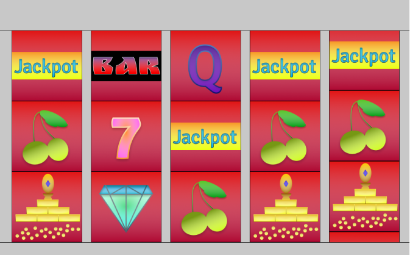

# Slot-Machine
This is my virtual 5 by 3 slot. I was inspired to make a slot machine because of their combination of flashy computer graphics and interesting probability charactersitics. Once the slot starts each symbol goes cycling through different positions in the reel until it reaches its destination. Even though only 3 symbols are visible at any given time, there is a total of 8 symbols which will cycle through in a set order.  While the symbols move quite fast, there is an exponential decrease in speed as the symbol approaches its destination. There is also a bounce at the very end of each cycle. Though the exact timing varies on each trial, the first reel will finish first, the second reel will finish second and so on. Every pull of the slot only takes a few seconds encouraging a rapid sytle of play.  Each of the 8 symbol has an equal chance of being chosen so there are 8^5 = 32,768 possibilites. My goal is for different combinations of symbols to have different payouts, ideally giving the house an edge of a few percentage points. All of the art of the symbols was custom and made by me. 

